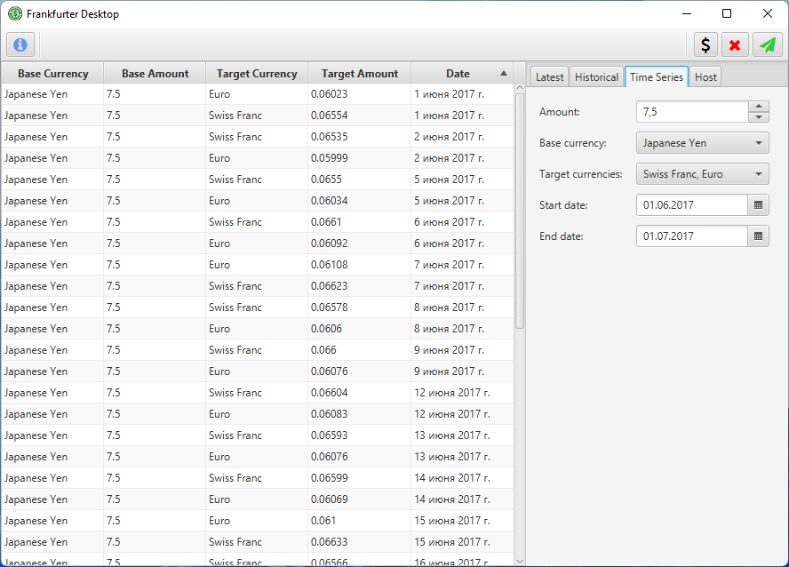

## About

**Frankfurter Desktop** is a simple, cross-platform desktop client for the [Frankfurter web API](https://github.com/hakanensari/frankfurter),
written in modern (17+) Java and JavaFX.

## Attributions
- Application icon is provided by [Freepik on Flaticon](https://www.flaticon.com/free-icon/exchange-rate_4646154?term=exchangerate&page=1&position=51&page=1&position=51&related_id=4646154&origin=tag)

## License
This software is distributed under the [Apache 2.0 license](./LICENSE).
