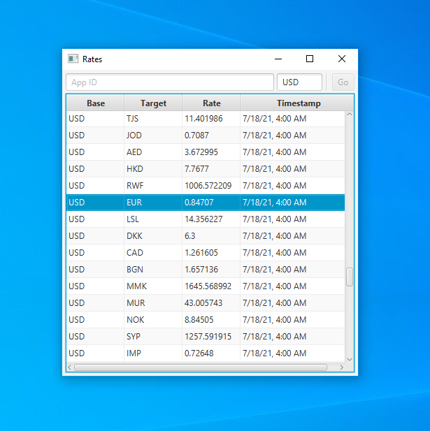

## About


**Rates** is a tiny demo [JavaFX 11](https://openjfx.io/) desktop client for the [Open Exchange Rates web API](https://openexchangerates.org/).

## Build
```
git clone https://github.com/altoukhov-max/rates.git
cd rates
mvn clean javafx:run
```

## Disclaimer
I am in no way, shape or form affiliated with [Open Exchange Rates](https://openexchangerates.org/), nor do I seek to purposely violate their terms and conditions with the usage and/or distribution of this software. If you are a representative of the previously mentioned organization and there is a problem, please let me know.
