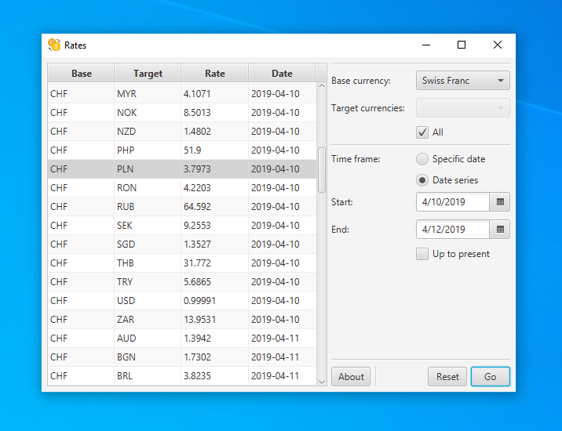

## About

**Rates** is a small and extremely simple cross-platform desktop application for browsing exchange rates. It relies on the
[Frankfurter web API](https://github.com/hakanensari/frankfurter) as its primary data provider.

## Build
Proper build and installation instructions are currently unavailable. If you'd still like to run the application in a "development environment",
simply open it as a project in (probably) any modern IDE, such as [IntelliJ IDEA](https://www.jetbrains.com/idea/).

## Attributions
* Icons were made by [Pixel Perfect](https://www.flaticon.com/authors/pixel-perfect) and provided by [Flaticon](https://www.flaticon.com/).

## License
This software is distributed under the [MIT license](./LICENSE).
