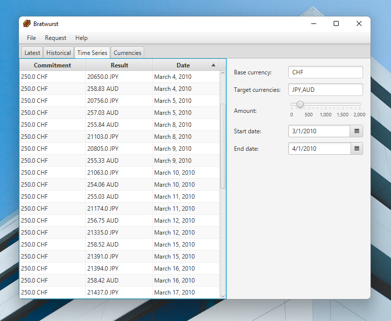

## About


**Bratwurst** is a simple cross-platform desktop client for the [Frankfurter](https://github.com/hakanensari/frankfurter) exchange rates web API, 
powered by Java and JavaFX.

## Building
The only prerequisite for building the project is to have the `JAVA_HOME` environment variable point to a JDK v17 installation. Once that requirement 
is satisfied, simply run the Maven wrapper as follows (if you're on a *nix system, you *might* also need to make the script executable with a `chmod 
+x` first):

```shell
./mvnw package # *nix
```

or

```shell
mvnw.cmd package # Microsoft Windows
```

For more information refer to the [Maven wrapper documentation](https://maven.apache.org/wrapper/).

You should now have an executable JAR file located in the generated `target/` directory (e.g. `target/bratwurst-3.0.0.jar`) that you can run on a
version-compatible JRE.

## Attributions
* Application icons are provided by [apien](https://www.flaticon.com/authors/apien) on [Flaticon](https://www.flaticon.com/)

## License
This software is distributed under an [MIT license](LICENSE).
