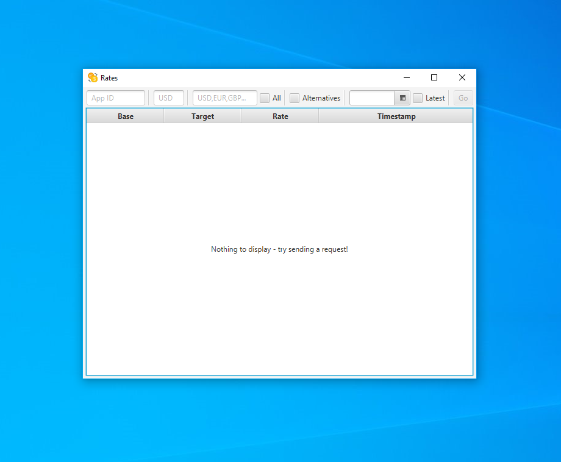

## About

**Rates** is a small [JavaFX](https://openjfx.io/) desktop application for fetching and displaying exchange rates from the
[Open Exchange Rates web API](https://openexchangerates.org/). It currently only supports
[latest](https://docs.openexchangerates.org/docs/latest-json) and
[historical](https://docs.openexchangerates.org/docs/historical-json) exchange rates.

## Disclaimer
I am in no way, shape or form affiliated with [Open Exchange Rates](https://openexchangerates.org/), nor do I seek to purposely
violate their terms and conditions with the usage and/or distribution of this software. If you are a representative of the
previously mentioned organization and there is a problem, please contact me.

## Attributions
* Icons were made by [Pixel Perfect](https://www.flaticon.com/authors/pixel-perfect) and provided by [Flaticon](https://www.flaticon.com/).

## License
This software is distributed under the [MIT license](./LICENSE).
